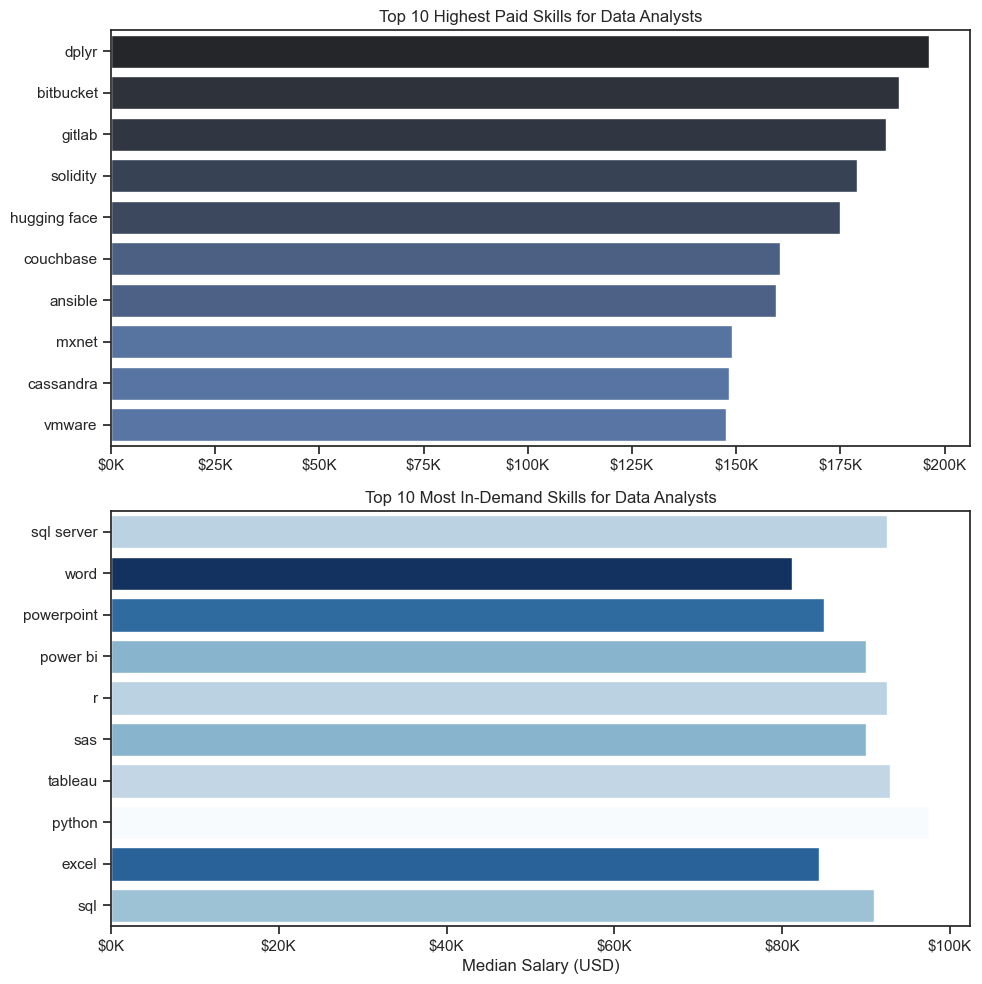
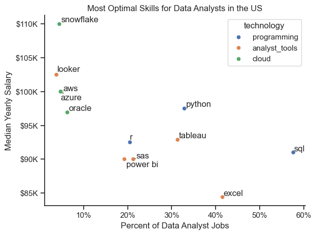

# The Analysis

🔍

## 1. What are the most demanded skills for the top 3 most popular data roles?

To find the most demanded skills for the 3 most popular data roles. I filtered out those positions by which ones were the most popular , and got the top 5 skills for these top 3 roles. This query highlights the most popular job title and their top skills , showing which skills I should pay attention to depending on this role I'm targeting.

View the skill count analysis here: [2_Skills_Count.ipynb](./3_Project/2_Skills_Count.ipynb)


### Visualize Data

```python
fid, ax = plt.subplots(len(job-titles),1)

for i, job_title in enumerate(job_titles):
    df_plot = df_skills_perc[df_skills_perc['job_title_short'] == job_title].head(5)
    sns.barplot(data=df_plot, x = 'skill_percent', y='job_skills', ax=ax[i, 0], hue='skill_count', palette='dark:b_r')

plt.show()
```

### Result




### Insights

### Insights
💡
- Python is a versatile skill, highly demanded across all three roles, but most prominently for Data Scientists (72%) and Data Engineers (65%).
- SQL is the most requested skill for Data Analysts and Data Scientists, with it in over half the job postings for both roles. For Data Engineers, Python is the most sought-after skill, appearing in 68% of job postings.
- Data Engineers require more specialized technical skills (AWS, Azure, Spark) compared to Data Analysts and Data Scientists who are expected to be proficient in more general data management and analysis tools (Excel, Tableau).

## 2. How are in-demand treanding for Data Analysts?

## Visualize Data

```python

from matplotlib.ticker import PercentFormatter

df_plot = df_DA_US_percent.iloc[:, :5]
sns.lineplot(data=df_plot, dashes=False, palette='tab10')
sns.set_theme(style='ticks')
sns.despine()

ax = plt.gca()
ax.yaxis.set_major_formatter(PercentFormatter(decimals=0))

plt.show()

```
### Results


### Insights

💡
- **Python** is a versatile skill, highly demanded across all three roles, but most prominently for Data Scientists (72%) and Data Engineers (65%).
- **SQL** is the most requested skill for Data Analysts and Data Scientists, with it in over half the job postings for both roles. For Data Engineers, Python is the most sought-after skill, appearing in 68% of job postings.
- **Data Engineers** require more specialized technical skills (AWS, Azure, Spark) compared to Data Analysts and Data Scientists who are expected to be proficient in more general data management and analysis tools (Excel, Tableau).


## 3. How well do jobs and skills pay for Data 
### Salary Analysis for Data Nerds 
### Visualize Data
```python
sns.boxplot(data=df_US_top6, x='salary_year_avg', y='job_title_short', order=job_order)
sns.set_theme(style='ticks')

plt.title('Salary Distribution in the United States')
plt.xlabel('Yearly Salary (USD)')
plt.ylabel('')
plt.xlim(0,600000)
ticks_x = plt.FuncFormatter(lambda y, pos: f'${int(y/100)}K')
plt.gca().xaxis.set_major_formatter(ticks_x)
plt.show()

```

#### Results


Insights
💰

High-Paying Roles: According to the boxplot, Senior Data Scientist and Senior Data Engineer roles command the highest median salaries, peaking around $150,000.

Salary Range for Analysts: While the median salary for Data Analysts is lower compared to specialized engineering roles, the pay scale is broad, typically ranging from $50,000 to over $100,000 depending on the company.

Significant Outliers: There are notable outliers in every role (some reaching up to $600,000), indicating that top-tier expertise in specific industries can lead to exceptionally high compensation.

Skill Correlation: Roles requiring advanced technical skills like Python and SQL generally align with higher salary brackets, as seen in the comparison between entry-level and senior-level positions.


# 3. How well do jobs and skills pay for Data 
### Higest Paid & Most Demand Skills for Data 
### Visualize Data

```python
fig, ax = plt.subplots(2, 1, figsize=(10, 10))
sns.set_theme(style='ticks')

sns.barplot(data=df_DA_top_pay, x='median', y=df_DA_top_pay.index, hue='median', ax=ax[0], palette='dark:b_r', legend=False)
ax[0].set_title('Top 10 Highest Paid Skills for Data Analysts')
ax[0].set_ylabel('')
ax[0].set_xlabel('')
ax[0].xaxis.set_major_formatter(plt.FuncFormatter(lambda x, _: f'${int(x/1000)}K'))

plt.show()

```

#### Result


Final Skill Insights
💰

Niche vs. Popular Skills: The top chart shows that niche technical skills like dplyr, bitbucket, and solidity command the highest median salaries, reaching up to $200,000.

Demand Stability: In contrast, the bottom chart reveals that widely used tools like SQL, Python, and Tableau have high demand but lower median salaries (around $90K - $100K) compared to specialized tools.

Optimal Career Path: For the highest financial growth, Data Analysts should master core high-demand skills (SQL/Python) and then specialize in one or more high-paying technical niches.


## 4. What is the most optimal skill to learn for Data Analysis

### Visulalize

```python
from adjustText import adjust_text
import matplotlib.ipynb as plt
#df_plot.plot(kind='scatter', x='skill_percent', y='median_salary')
sns.scatterplot(
    data=df_plot,
    x='skill_percent',
    y='median_salary',
    hue='technology'
)
plt.tight_layout()
plt.show()

```

#### Result
### Optimal Skills for Data Analysts


📊 Data Analyst Portfolio Insights: Demand vs. Salary
Based on the finalized scatter plot analysis of the US job market, several key trends emerge regarding the most "optimal" skills for Data Analysts:

The Industry Standard (High Demand): SQL and Excel dominate the job market in terms of volume. SQL is a requirement in nearly 60% of job postings with a median salary of $91K, while Excel remains a baseline skill with high demand but a lower median salary of $84K.

The Optimal Sweet Spot: Python and Tableau represent the best balance between market demand and high pay. With over 30% market presence and salaries ranging from $93K to $98K, these are the most strategic skills for a professional to master for career growth.

High-Value Specialization (Niche Power): Cloud-based technologies like Snowflake, Looker, and AWS offer the highest earning potential. Snowflake leads with a peak median salary of $110K. While these skills appear in fewer than 10% of job postings, they command a significant salary premium for specialized roles.

Technological Advantage: Skills categorized under Cloud (green) and Programming (blue) generally show a higher "salary floor" compared to general Analyst Tools (orange).


📊 Project Summary: Data Analyst Salary & Skills Analysis
This project explores the intersection of job demand and salary for Data Analysts in the US. By analyzing thousands of job postings, the goal was to identify "Optimal Skills"—those that offer both high market demand and competitive compensation.

Key Insights
The Foundation (High Demand): SQL and Excel remain the most requested skills in the industry. SQL is featured in approximately 60% of job postings with a median salary of $90K, while Excel shows high volume but a lower median salary of $85K.

The Optimal Tier (The "Sweet Spot"): Python and Tableau represent the most balanced skill set for professionals. They maintain a strong market presence (30%+ demand) while commanding higher salaries ranging from $95K to $100K.

High-Value Niches: Specialized cloud and big data tools like Snowflake, Looker, and AWS offer the highest earning potential. Snowflake leads the pack with a median salary of $110K, despite appearing in fewer than 10% of total job postings.

Technology Breakdown: Skills categorized under Cloud and Programming generally offer higher salary floors compared to standard Analyst Tools.
